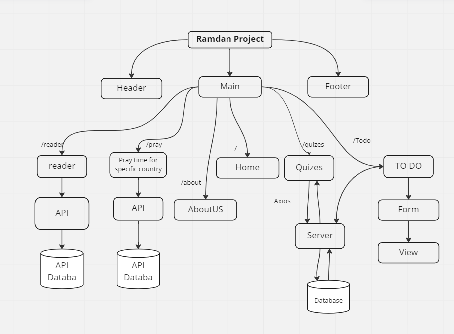
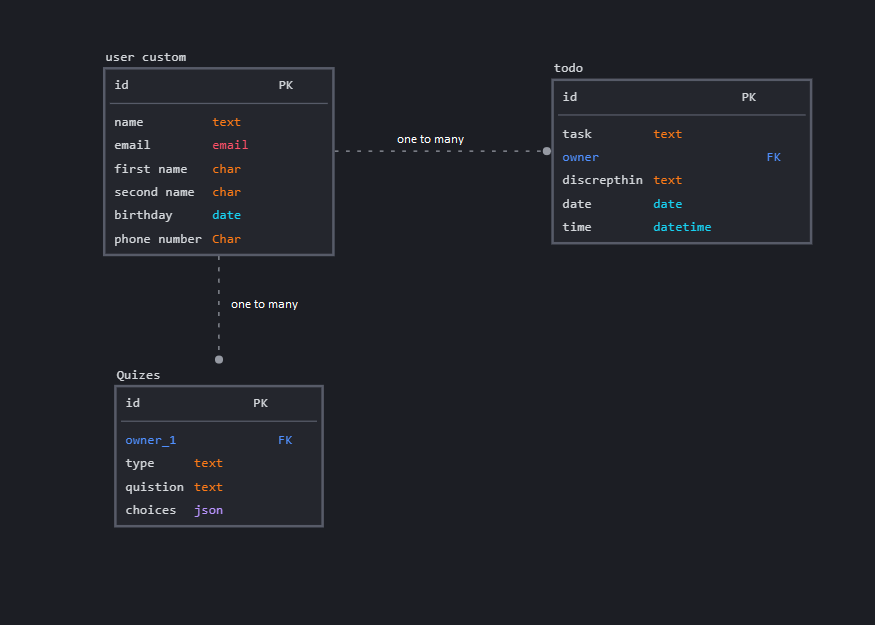

# Wireframe_and_user_story

	
- Title HOME 
- User Story sentence
  In ths page the user will see aya from quran and it will change every refrach the page, also there will be a table for today prey time and a counter for "ذكر"
 - Feature Tasks:
  add al-hegry date 

- Title Praytime 
- User Story sentence
  In ths page the user will see a table with 30 row that has 5 culomes for the five pray of the date on index location
- Feature Tasks:
  enter the number needed days
	
- Title quiz 
- User Story sentence
  In ths page the user will have to be login and have a user then after start the quiz the system will provide him with 10 qustions from the database.
- Feature Tasks:
  incrace the number of qustions in the database
	
 - Title Reader 
- User Story sentence
  In ths page the user will choose a sura and the name of the reader from a drop list then the audio will start running

- Feature Tasks:
  link to youtube 

 - Title todo 
- User Story sentence
  In ths page the user should login to use this page and create a list for tasks can be delete and update

- Feature Tasks:
  the admin can delete or edit
	

## Domain Modeling
	
## DATABASE diagram
	
