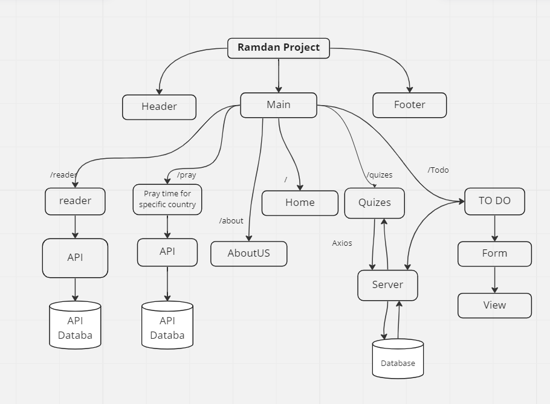

# requirements

### What is the vision of this product?

The Ramdan is coming so for that we decided to make a web site that will contain many kinds of pages that will engourge to do worshib in a good way and every user can make his plan on it to organize his time for that.

### What pain point does this project solve?

Easy to use and have many things that will be usfel on a day life.

### Why should we care about your product?

The website can be help people to make his lifestyle organize with many useful activity that will improve his inner self and the out one.

## Scope (In/Out):

### IN:
1. provide pray times on any loction
2. The web app will provide many readers for all quran
3. quiz to your islamic knowlage
4. The user can add what he wants to do in the day and at a specific time
5. Coutner for "ذكر"

### OUT:
1. We dont have any quran secines
2. change it to be a mobile app.
3. the user can get an appointment to read on tacher hand.
4. Hafez Quran Program
### What will your MVP functionality be?
	
### What are your stretch goals?
toggle between two languages

### Functional Requirements
#### Admin 
1. add and delete qustion from the database
2. 
#### user
1. provide pray times on any loction
2. The web app will provide many readers for all quran
3. quiz to your islamic knowlage
4. The user can add what he wants to do in the day and at a specific time
5. Coutner for "ذكر"

### Data Flow
before sign in the normal user can see the home, pray and reader page likwise when he sign in, in addtion th sgin in he can do quiz and make his plans in to do page

### Non-Functional Requirements
#### Testability
Testing a web application is a complex task, because a web application is made of several layers of logic – from HTTP-level request handling, to form validation and processing, to template rendering. With Django’s test-execution framework and assorted utilities, you can simulate requests, insert test data, inspect your application’s output and generally verify your code is doing what it should be doing.

#### Security
Password generation: An application may not grant access until the user creates a strong password. For example, a strong password might contain a certain number of characters and a capital letter.